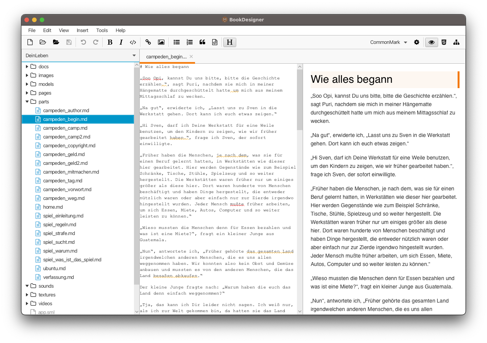

# BookDesigner
==================

An open source ebook editor written in JavaFX.

For Markdown rendering it uses [commonmark-java] or [flexmark-java],
two Java implementations of the [CommonMark] specification.

Features
--------

  * Syntax highlighting in editor
  * Keyboard shortcuts to insert Markdown (Bold, Italic, Code, Links, Images, Header, Lists, ...)
  * Auto-indent lists
  * Search and replace
  * Spell and grammar checking with [LanguageTool](https://languagetool.org/)
    for more than 30 languages and dialects.
  * Project manager
  * HTML preview
  * HTML source preview
  * Markdown AST view
  * Multi-platform: Windows, Mac and Linux

Download
--------

See "Assets" in
[releases section](https://github.com/crowdware/bookdesigner/releases).

Changes
-------

See [Change Log](CHANGES.md)

Building
--------

[Gradle](https://gradle.org) can be used to build BookDesigner from source
code. **Java 19** is required to run Gradle (and BookDesigner).

The Gradle task `assembleDist` builds a distribution for the current platform
(uses `jpackage`) and requires that Gradle is running on a JDK that includes
JavaFX. E.g. BellSoft Liberica JDK (package 'Full JDK') or Azul Zulu JDK
(package 'JDK FX').

Credits
-------

  * Karl Tauber for [Markdown Writer FX]
  * Tomas Mikula for [RichTextFX], [ReactFX], [WellBehavedFX], [Flowless] and [UndoFX]
  * Mikael Grev for [MigLayout] and Tom Eugelink for MigPane
  * Vladimir Schneider for [flexmark-java] Markdown parser
  * Atlassian for [commonmark-java] Markdown parser
  * Jens Deters for [FontAwesomeFX]
  * The [ControlsFX] project
  * Matthieu Brouillard for [CSSFX]
  * Lea Verou, Golmote & more for [Prism]

License
-------

*BookDesigner* is open source licensed under the [GPL-3.0](LICENSE)

   [Markdown Writer FX](https://github.com/JFormDesigner/bookdesigner)
   [Markdown]: http://daringfireball.net/projects/markdown/
   [CommonMark]: http://commonmark.org/
   [commonmark-java]: https://github.com/atlassian/commonmark-java
   [flexmark-java]: https://github.com/vsch/flexmark-java
   [Markdown Extra]: https://michelf.ca/projects/php-markdown/extra/
   [MultiMarkdown]: http://fletcherpenney.net/multimarkdown/
   [Github-flavoured-Markdown]: https://help.github.com/articles/github-flavored-markdown/
   [MigLayout]: https://github.com/mikaelgrev/miglayout
   [RichTextFX]: https://github.com/TomasMikula/RichTextFX
   [ReactFX]: https://github.com/TomasMikula/ReactFX
   [WellBehavedFX]: https://github.com/TomasMikula/WellBehavedFX
   [Flowless]: https://github.com/TomasMikula/Flowless
   [UndoFX]: https://github.com/TomasMikula/UndoFX
   [FontAwesomeFX]: https://bitbucket.org/Jerady/fontawesomefx
   [ControlsFX]: http://fxexperience.com/controlsfx/
   [CSSFX]: https://github.com/McFoggy/cssfx
   [Prism]: https://github.com/PrismJS/prism
